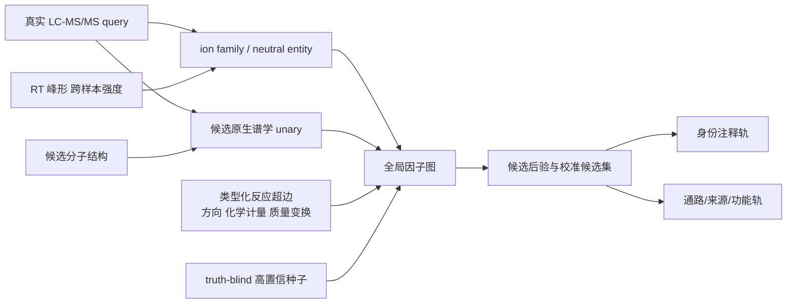

# BioAware 全景调研与战略裁决

## 执行结论

BioAware 过去的根本问题，不是“网络模型还不够复杂”，而是把四个不同问题混成了一个问题：谱图相似度、谱图到分子候选检索、样本内全局特征注释、以及生物功能推断。它们拥有不同的观测信息、监督信号、部署接口和评价指标。一个只看干净 MS/MS 的共享 embedding，原则上无法忠实编码“这个候选是否在当前参考库中”“同一样本还观测到哪些种子”“该特征属于哪个离子家族”等运行时上下文。

现有证据支持以下严格判断：

1. B30/B37 的约 `+5.9 pp` 是真实、可重放的已打开开发集行为，但主要来源于候选是否进入代谢知识目录及其目录中心度，而不是具体反应边、样本内传播或生物机制。B44 的独立 MassBank 迁移变成 `-0.56 pp`；在 B45 中匹配目录覆盖和度数后，真实拓扑只剩 `+0.23 pp` 且不显著；B46 的“反应变换 + 共丰度”反而为 `-0.77 pp`。因此，不能把 B30 直接蒸馏或微调进共享 DreaMS encoder。
2. 此前提出的“精确事件图”方向是必要条件，但仍不完整。现代候选检索首先需要强的谱图—分子 unary；现代 LC–MS 注释还必须处理离子形式、参考谱复数偏置、RT/峰形、跨样本丰度、候选间全局一致性和不确定性。只把 Rhea 一步邻接加入 DreaMS 分数，既不是 MetDNA3/KGMN 的完整复现，也不是一个有竞争力的新方法。
3. 最高性价比的主线应改为一个分层、可消融的系统：**候选原生谱学评分器 → 离子家族与中性分子层 → 类型化反应超图 → 样本级全局推断 → 选择性输出/校准**。BioAware 的创新位置在后三层；通用 DreaMS embedding 不承担样本上下文。
4. B47 的 51,976 个真实样本事件是目前最重要的资产，但它只是 truth-blind 候选分母，不是已经建立的性能面板。当前候选构造把 `[M+H]+` 与 `[M+Na]+` 参考谱放入同一未知 adduct 的质量窗口，并以候选的多张参考谱取最大值；候选参考谱数中位数 20、P90 103、最大 619。这会产生显著的离子形式混杂和极值/参考谱数量偏置，必须在打开真值前修正。
5. 近期不应直接训练大型 GNN，也不应承诺 `+5 pp`。先用 B47 建立三个递进、可证伪的增量：强 unary、离子家族、真实反应事件。只有真实反应事件在强 unary 和离子家族之上仍通过来源/分子式聚类置信区间及结构化空模型，才进入 context-conditioned embedding。否则 BioAware 应保留为后验全局注释器，而不是强行写进共享谱图空间。

## 一、先把“大象”分清：六类相邻但不同的任务

| 层级 | 科学问题 | 推理时可见信息 | 合理输出 | 代表方法 | 不应混用的结论 |
|---|---|---|---|---|---|
| A. 谱图表示/谱图库检索 | 两张谱图是否来自同一或相似结构 | query MS/MS、reference MS/MS | 谱图 embedding 或相似度 | DreaMS、MS2DeepScore 2.0 | 不能由此宣称候选分子结构排序 SOTA |
| B. 谱图到分子候选检索 | 给定候选结构，哪个分子最能解释谱图 | MS/MS、候选 SMILES/图、公式/adduct | 候选分数与 rank | MIST、JESTR、MVP、FLARE、MSAlign、FIORA、CFM-ID | 不能把谱图—谱图 cosine 当成完整的谱图—分子模型 |
| C. LC–MS 离子实体解析 | 哪些 feature 是同一中性分子的 adduct/isotope/ISF | m/z、RT、峰形、样本强度、MS/MS | ion family / neutral entity | CliqueMS、IIMN、NetID | feature 不是 molecule；重复离子不能当独立生物证据 |
| D. 样本内全局注释 | 多个 feature 的候选如何在同一样本中联合选择 | B+C 加代谢关系、共丰度、种子 | 全局候选后验或一致 assignment | MetDNA、KGMN、MetDNA3、NetID、PUMA | 不是逐 query 重排；局部增益不能替代全局一致性 |
| E. 未知物与类似物发现 | 数据库外结构或结构改造在哪里 | 邻居结构、质量偏移、峰对齐、生成先验 | 新结构/修饰位点/未知物优先级 | ModiFinder、DeepMet、MetGenX、StructureMASST | 不是封闭候选集 Top-1 问题 |
| F. 生物功能解释 | 哪些通路、来源或功能模块发生变化 | 样本矩阵、表型、代谢网络，可能无精确身份 | pathway/origin/module posterior | PIUMet、PUMA、MS2MP、TidyMass2 | 通路性能不能包装成分子身份正确率 |

DreaMS 的原始优势位于 A：它从大规模未标注谱图学习通用表示，并通过 hard-example contrastive fine-tuning 增强相近结构的区分；论文同时明确指出零样本相似度对微小结构差异不够敏感。[^1] MassSpecGym 则把分子检索、从头结构生成和谱图模拟明确拆成不同任务。[^2] 2026 年的 MassSpecGym 审计预印本进一步指出，已有工作中常见公式泄漏、候选集捷径、实现偏差和指标不一致；其审计覆盖的 26 篇论文中至少 17 篇存在一类问题。[^3] 因此，任何“超过 DreaMS”都必须限定任务、候选构造、拆分、指标和比较接口。

## 二、2024–2026 方法全景：各路线真正解决了什么

### 2.1 通用谱图表示与鲁棒相似度

DreaMS 通过大规模自监督学习得到谱图表示，再用同分子正例和近质量负例做对比微调。它适合谱图库检索、谱图聚类和迁移任务，但它没有直接读取候选分子结构。[^1]

MS2DeepScore 2.0 仍学习谱图—谱图的化学相似度，但新版显式加入元数据、优化样本对采样，并移除了 dropout 和 batch normalization，同时降低峰移除/强度扰动的幅度。[^4] 这与本项目的经验一致：随机、大剂量或 train/eval 不一致的“噪声”并不会自动产生有益化学梯度。化学约束的 Denoising Search 则只删除无法由前体分子式解释的噪声峰，在人血浆实验中显著扩大注释覆盖；它说明有效噪声操作应有物理可实现性，而非统一随机删峰。[^5]

对 BioAware 的含义：通用谱图 embedding 应继续服务于 A 层，并可通过实证 acquisition noise、硬负例和谱学因果干预改善；但样本网络或候选目录不是谱图本身的属性，不应无条件蒸馏进这一空间。

### 2.2 谱图—分子候选检索：当前最容易被我们低估的一层

JESTR 直接学习谱图与分子图的联合 embedding，并用相似公式候选作正则化；作者报告候选正则化提高 rank@1。[^6] MVP 将单谱、共识谱、分子图等多视图联合对齐，并显示多谱共识与聚合策略对候选检索重要。[^7] MSAlign 则以冻结 DreaMS 和 ChemBERTa 为两侧基础模型，只训练轻量投影并使用候选组内对比目标，是复用现有 DreaMS 资产的低成本路线。[^8]

FLARE 不再依赖两个全局向量的单次 cosine，而使用峰—原子双向局部对齐；作者在 MassSpecGym 报告显著高于多个全局 embedding 基线的 rank@1，但这些数值仍需在 v1.5 审计协议下独立复现。[^9] FIORA 和 CFM-ID 属于前向模型：从候选分子预测碎裂或谱图，再问“候选能否解释观测谱图”。FIORA 进一步把局部化学键环境、碰撞能、仪器、RT 和 CCS 纳入预测。[^10][^11]

这给出一个对本项目非常关键的判断：B30–B47 一直以 DreaMS 的谱图—谱图相似度作为候选 unary，而最新候选检索 SOTA 倾向于读取候选结构、局部峰—原子关系或预测碎裂。若 unary 本身没有回答“这个分子能否产生这些峰”，BioAware 的目录先验会被迫补偿谱学不足，并很容易学成数据库熟悉度。

### 2.3 离子家族：网络传播之前必须解决的观测层

CliqueMS 用共洗脱曲线和经验 adduct 频率进行最大似然离子分组与母体质量推断。[^12] IIMN 将 RT/峰形相关、adduct/isotope/in-source fragment 关系接入分子网络，并允许把同一分子的多个离子折叠为一个实体。[^13] NetID 进一步在质量、RT、MS/MS、adduct、isotope、in-source fragment 和生化变换之间做全局优化，而不是逐 feature 贪心。[^14]

这不是可选的“额外特征”。B47 当前将未知 adduct query 与 `[M+H]+`、`[M+Na]+` 参考谱混在同一质量窗口；若不先建立中性分子和 ion-family 假设，反应边、共丰度和种子数都可能重复计数同一分子，或把 in-source fragment 当成代谢产物。

### 2.4 代谢网络传播：MetDNA/KGMN 真正做的远多于一步加分

MetDNA 从高置信种子开始，沿代谢反应网络寻找相邻候选，再用相邻代谢物的 MS/MS 相似性递归传播。[^15] KGMN 同时整合知识反应网络、知识引导的 MS2 相似网络和全局峰相关网络；其高正确率是在该完整多层工作流与特定已知代谢物评价中取得，不能等同于通用候选检索。[^16]

MetDNA3 的重要更新不是“更多跳数”，而是知识层与数据层的双层对齐：先由 MS1/RT 等信息预映射，再要求反应关系与实验 feature 网络一致后传播；它还以 GNN 扩展潜在反应对，但论文明确把预测边与知识边区分，并用种子比例、重复拆分和 FDR 评估传播。[^17] MRMN 在药物代谢专用场景中又加入内源干扰排除、冗余离子识别和谱图特征退化校正，说明生物/化学网络必须和观测过程共同建模。[^18]

对 BioAware 的含义：我们先前的 `DreaMS score + Rhea adjacency/path summary` 只覆盖了这些系统的一小部分，而且恰好缺失了最关键的离子实体、实验边与全局约束。B38–B40 中直接路径和四跳扩散失败，不能简单解释为“反应网络无用”；更准确的结论是：**在缺失 ion-family、强 unary、精确事件和全局 assignment 的条件下，候选级标量传播没有表现出特异增益。**

### 2.5 反应边不应只是二元邻接

ModiFinder 通过已知—未知谱图中未偏移/偏移峰的对齐，把质量变化定位到候选结构的原子区域；它展示了“反应/修饰关系”应对观测峰产生可检验的方向性预测。[^19] BAM/PROXIMAL 系列则把酶促变换写成可作用于结构的反应规则，用于生成可能产物，而不是把知识图上的邻接当作无条件正分。[^20]

MuSHIN 虽然解决的是代谢模型缺失反应预测而非谱图注释，但其反应超图表示值得借鉴：代谢物是节点，完整反应是超边，通过 node–hyperedge 双向注意力保留多底物、多产物和反应语义。[^21] 一个普通 pairwise 图会丢失共底物、辅因子、反应方向和化学计量；这正是 B39 在 reaction ID、方向、超边完整性和谱学证据逐层取交集后几乎失去覆盖的原因。

### 2.6 生物上下文不只有“精确身份重排”这一种终点

PUMA 用概率生成模型联合推断通路活性和质量特征的候选身份，显式保留注释不确定性。[^22] PIUMet 使用代谢物—蛋白互作网络寻找能解释未注释特征的疾病相关子网络，重点是系统机制而非每个峰的唯一身份。[^23] MS2MP 直接从 MS/MS 碎裂图预测 KEGG 通路，作者报告跨验证 balanced accuracy 94.1%，三个独立测试集 87.8%–91.2%，从而绕过“先把所有峰精确注释”这一瓶颈。[^24] TidyMass2 也把代谢物来源推断与基于未注释 feature 的功能模块分析分开，并明确其 mass-based 模块仍属于较低 MSI 置信级别。[^25]

DeepMet 的路线又不同：它学习哺乳动物代谢物的结构语言，为数据库外未知物提供候选宇宙先验；其前瞻性验证说明“什么结构可能真实存在”可以由代谢物化学空间学习，而不必依赖已记录的一步网络边。[^26] StructureMASST 则从结构反向搜索全球公共谱图和元数据，服务于分布、来源与类似物发现。[^27]

对生物学课题的含义：BioAware 应保留两条互补输出。

- 身份轨：提高候选结构排序，但必须接受不确定性并有保守 abstention。
- 功能轨：即使身份仍为集合，也可以进行通路/来源/模块推断；这条轨不能反过来伪装成结构真值。

### 2.7 不确定性是系统组成，不是报告附录

2026 年的选择性预测工作显示，候选检索中的简单 ranking confidence 和 retrieval-level uncertainty 往往比 fingerprint-level uncertainty 更适合风险—覆盖控制。[^28] 同年的 conformal retrieval 工作进一步为每张谱图输出满足目标覆盖率的候选集合；在分布漂移下，集合会自然变大，暴露“模型无法区分”而非强迫错误 Top-1。[^29]

因此，BioAware 的最终接口不应只有一个强制 Top-1。它必须输出候选后验、校准候选集和 abstention，并分别报告 coverage、conditional risk 与候选集大小。

## 三、竞争方法矩阵：哪些可复用，哪些不能照搬

| 方法族 | 最强可复用思想 | 主要缺口/风险 | 对 BioAware 的位置 |
|---|---|---|---|
| DreaMS / MS2DeepScore | 通用谱图表示、跨条件鲁棒性、硬负例 | 不直接读取候选结构 | 基础谱图 encoder，不是完整候选系统 |
| JESTR / MVP / MSAlign | 候选组内、多模态对齐、多谱共识 | 可能受候选构造与拆分影响 | 最优先补齐的强 unary |
| FLARE / FIORA / CFM-ID | 峰—原子局部证据或候选前向碎裂 | 计算更重；部分论文结果需严格复现 | 高价值候选特异证据与解释层 |
| CliqueMS / IIMN | 折叠 ion form，利用 RT/峰形和跨样本相关 | 分组本身可能有误，需独立评价 | 网络传播前的必需观测层 |
| NetID | 全局一致 assignment | 依赖特定规则与优化设定 | BioAware 全局推断的直接先例 |
| MetDNA / KGMN / MetDNA3 | 种子传播、知识层×数据层、全局峰相关 | 递归错误传播、种子泄漏、数据库偏倚 | 对标系统，但不能只复现一步路径 |
| ModiFinder / BAM | 类型化变换和可检验峰偏移 | 覆盖有限、对 helper/结构候选有要求 | 反应超边的谱学 compatibility |
| PUMA / PIUMet / MS2MP | 在身份不确定时仍推断生物功能 | 功能正确不等于身份正确 | 独立的 biology endpoint |
| DeepMet / StructureMASST | 数据库外候选宇宙、公共样本分布 | 任务与封闭候选 Top-1 不同 | 远期未知物与外部验证 |
| Selective/conformal retrieval | 可控风险、候选集合、分布漂移响应 | 不会创造新判别信号 | 所有部署结果的最后安全层 |

2026 年一个仍在同行评议中的 MOLERANKER 预印本把谱图相似边、跨样本浓度共现边和候选结构放入异构图，以 relation-aware message passing 与双塔排序联合建模。[^30] 它说明“候选结构 + 样本共现 + 谱图”联合建模已成为前沿竞争方向，但其当前证据仍是未定稿论文，不能作为本项目的性能真值或直接复制对象。

## 四、把 B30–B47 放回正确坐标系

### 4.1 已经建立的事实

| 内部节点 | 结果 | 严格含义 |
|---|---:|---|
| B30/B37 | 约 `+5.93 pp`，54–55 corrected、3–4 introduced | 已打开六域上的候选目录/中心度风险路由正信号 |
| B36 | catalogue `+5.58 pp`; reaction-only `+1.40 pp` 且聚类 CI 跨零；full 低于 catalogue | 当前聚合的反应特征没有在 catalogue 之上增量 |
| B38 | 加显式直接路径后相对 topology `-0.93 pp`；更丰富 event summary `-1.98 pp` | 候选级路径汇总损失了信息或引入错误方向 |
| B39 | 严格 reaction-ID×方向×超边×双层证据交集覆盖约 `0.73%` | 不是弱信号，而是观测链条不完整、可识别样本不足 |
| B40 | 四跳扩散相对 topology `-3.69 pp`；sample-local ST001154 相对 topology `-13.28 pp` | 更深传播放大了度数/种子偏差，不能靠加 hop 修复 |
| B44 | 独立 MassBank `-0.56 pp`，8/13 | catalogue prior 跨资源反转，开发增益不便携 |
| B45 | coverage-neutral topology `+0.23 pp`，4/2，CI 跨零，不胜 degree permutation | 拓扑本身尚未证实独立贡献 |
| B46 | real transform + coabundance `-0.77 pp`，10/21 | 聚合上下文不是候选—种子—反应的可迁移事件证据 |
| B47 | 51,976 truth-blind 实样本 query；82,302 reference embedding；2,078,709 candidate-reference links | 大规模候选分母与执行缓存已成形；尚未打开真值或证明增益 |

这些项目内数字来自冻结报告和哈希工件。[^31][^32][^33][^34][^35][^36][^37][^38]

### 4.2 为什么 `+5.93 pp` 不能直接“注入 embedding”

假设 B30 的动作主要来自 `network_member(c)` 和 `degree(c)`，则它实际学习的是：

\[
P(c\text{ is truth}\mid c\text{ is catalogued},\,\deg(c),\,\text{candidate set}).
\]

而共享谱图 encoder 的输入只有谱图 \(x\)，只能学习 \(E(x)\)。同一张谱图在不同数据库、不同候选宇宙和不同版本的 Rhea/HMDB 中，`network_member` 与 `degree` 可以改变，而 \(x\) 不变。不存在一个候选无关映射 \(E(x)\) 能忠实恢复这类运行时变量。强制蒸馏的结果只能是把“常见化合物的谱图样式”当成目录成员代理，形成数据集偏置；B44 已经展示这种代理跨库会反转。

这不是优化器问题，也不是“学生太弱”。它首先是**信息可得性不匹配**。只有两类信息适合进入共享谱图 embedding：

1. 谱图自身可观测、跨候选库稳定的谱学规律；
2. 训练时使用上下文，但能够通过严格消融证明其作用在推理时可由谱图本身恢复的方向。

样本、候选或数据库特异上下文应该进入条件表示或后验推断，而不是基础共享 embedding。

### 4.3 B47 当前最危险的三个捷径

1. **参考谱极值偏置**：对候选的多张参考谱取 max 时，拥有更多参考谱的候选天然获得更大的极值。B47 每 query 的候选参考谱数从 2 到 619，偏置规模不可忽略。
2. **未知 adduct 混杂**：query adduct 未知，而 `[M+H]+`、`[M+Na]+` 同池竞争。正确候选可能因 ion form 不匹配被低估；错误候选也可能因质量窗口和参考谱覆盖偶然获益。
3. **同源自举/循环种子**：若高置信种子由同一个 DreaMS scorer 产生，再用它们去“验证”DreaMS 候选，网络可能只放大初始模型偏好。需要 leave-ion-family-out、truth-originally-absent、独立库匹配与结构空模型。

## 五、修订后的算法：BioAware 因子化全局注释系统

暂用工作名 **BioAware-FactorGraph**。这不是要立刻实现一个巨型模型，而是规定信息应该在哪一层进入，以及每层如何被单独证伪。

### 5.1 谱学 unary：先让模型真正读候选结构

对 query \(q\) 与候选结构 \(c\)，定义候选原生分数：

\[
U_q(c)=f_{\mathrm{spec-mol}}(x_q,c,\mathrm{adduct},\mathrm{CE},\mathrm{instrument}).
\]

短期首选是 MSAlign 风格：冻结 DreaMS spectrum encoder，引入分子 encoder，只训练小型候选组内投影/交互层。这样成本远低于从头训练 FIORA 或 FLARE，同时消除“候选仅由参考谱数量代表”的根本缺陷。必须并行保留以下无训练基线：DreaMS max、每候选共识谱、reference-count 校准 log-sum-exp、sqrt cosine、neutral-loss，以及只看 reference count 的 spectrum-blind shortcut。

### 5.2 离子实体因子：先解释观测，再谈代谢

对可能属于同一中性分子的 feature 集合 \(F_k\)，建立：

\[
\phi_{\mathrm{ion}}(F_k)=g(\Delta m,\Delta RT,\text{peak-shape corr},\text{sample corr},\text{adduct prior}).
\]

离子分组必须有独立准确率/覆盖率评价，并在全局图中防止同一 neutral entity 的多个离子重复投票。若 B47 缺乏足以重建峰形的数据，先明确降级到 RT + abundance + mass relation，而不是假装拥有 IIMN 等价证据。

### 5.3 类型化反应超边：只有可验证的化学变换才进入

反应因子不是 `candidate is within k hops of seed`，而是：

\[
\phi_{\mathrm{rxn}}(c,s,r)=
h(\text{reaction ID},\text{side},\Delta\text{formula},\Delta m,
\text{shifted/unshifted peaks},\text{RT/CCS},\text{sample evidence}).
\]

多底物/多产物反应用超边表示；currency metabolites、泛化辅因子和高 degree 节点必须显式降权。共丰度的符号不能默认正：在稳态、时间序列、疾病扰动和底物—产物关系中，相关方向可能不同；不能判断时置为 missing，而不是零或正票。

### 5.4 全局 assignment：候选不是相互独立的

令每个中性 feature \(i\) 的候选身份为离散变量 \(y_i\)，则：

\[
\log p(\mathbf y\mid X)=
\sum_i U_i(y_i)
+\sum_k\phi_{\mathrm{ion},k}(\mathbf y)
+\sum_r\phi_{\mathrm{rxn},r}(\mathbf y)
+\sum_s\phi_{\mathrm{sample},s}(\mathbf y)
-\sum_j\phi_{\mathrm{conflict},j}(\mathbf y).
\]

第一版可以使用可审计的 CRF/因子图或 ILP，不必立刻用端到端 GNN。这样每次 Top-1 改动都能归因于具体 unary、ion、reaction 或 conflict 因子，并可与 NetID/MetDNA/KGMN 的思想正面对照。

### 5.5 条件表示，而不是污染通用 embedding

若事件级动作通过外部门，才训练：

\[
z_{q,c}^{ctx}=z_q+alpha_{q,c}A(z_q,m_c,h_{ion},h_{rxn},h_{sample}),
\]

其中 \(z_q\) 是通用 DreaMS 表示，\(m_c\) 是候选分子表示，\(A\) 是候选与样本条件 adapter，\(\alpha\) 是可校准门控。无上下文时 \(\alpha\to0\)，严格回退到基础模型。

这不是“一个谱图一个固定 embedding”，而是同一谱图面对不同候选和样本上下文时的条件表示。论文中必须把 `universal spectral embedding` 与 `context-conditioned candidate representation` 分开命名和评价。

## 六、最高性价比实验顺序

### 阶段 0：冻结任务与真值边界

不打开 B47 sealed truth。先冻结：query、candidate、reference、ionization、sample、source、formula、reference multiplicity 和所有算法输入的哈希。确认真正的独立真值来自标准品、RT + MS/MS 或明确的外部 annotation tier，而非另一算法输出。

**停止条件**：若没有至少 1,000 个可评价真值 query、200 个 formula、200 个基础模型错误和 100 个反应可达错误，则不能评价 `+3 pp` 反应增益，只能做可行性研究。

### 阶段 1：建立强而公平的谱学 unary

同一 B47 候选集上比较：

1. DreaMS reference max；
2. reference-count 校准的 log-sum-exp / empirical-Bayes 聚合；
3. per-candidate consensus embedding；
4. neutral-loss / entropy / sqrt cosine；
5. 轻量 spectrum–molecule 对齐；
6. spectrum-blind 的 reference count、catalog membership、canonicalization 等捷径。

模型选择按 source × formula 嵌套拆分；报告 Recall@1/5/10/20、MRR、macro query AUC、MCES 分层、reference-count 分层和 calibration。任何谱图盲基线表现异常强都触发候选构造审计，而非继续训练。

**进入阶段 2 的条件**：强 unary 至少不弱于 DreaMS max，且增益不能由 reference count、formula、catalog membership 或 candidate ordering 解释。

### 阶段 2：离子家族单独建模和验收

先不使用反应网络。用 m/z、RT、峰形/强度相关和 adduct/isotope/ISF 规则建立 neutral entity；评价 ion-family precision/recall、重复折叠率及其对候选检索的净影响。

**进入阶段 3 的条件**：相对强 unary，overall 与 near 不退化；corrected > introduced；离子折叠对随机/错误质量差关系有显著优势。

### 阶段 3：精确反应事件的零学习动作试验

只在候选—种子—reaction-ID—方向—超边都可重放的事件上，加类型化反应因子。逐事件保存质量变换、峰偏移一致性、RT/CCS、样本证据和 nuisance variables。

必须对比：degree/component/arity 匹配的图重连、seed permutation、wrong-sign transform、matched non-neighbour、catalogue-only、以及相同覆盖率的随机门。

**进入阶段 4 的条件**：在强 unary + ion-family 基线上仍有至少 `+3 pp`；formula 与 source cluster CI 下界 > 0；`corrected > 2×introduced`；所有主要来源非负；真实事件优于全部结构空模型。

### 阶段 4：全局因子图，而非继续局部加分

比较独立 query rerank 与全局 assignment。预先限定因子和容量，避免在打开的 B47 结果上反复调结构。主要增量应来自冲突消解、ion-family 一致性和多事件联合，而非 catalogue membership。

### 阶段 5：风险控制与外部验证

输出 Top-1 的同时输出 conformal candidate set 和 abstention。评价 risk–coverage 曲线、90%/95% 目标覆盖下的集合大小、按 source/formula/candidate-count 的条件覆盖，以及分布漂移下的退化。

### 阶段 6：有条件的 embedding 实验

只有阶段 3–5 通过才训练 context adapter。必须有四臂：真实事件、context removed、rewired/seed-permuted context、同剂量随机 context；并分别测 universal embedding preservation 和 context-conditioned ranking。不得把 B30 catalogue action 作为 encoder 真值。

### 阶段 7：独立生物学终点

在身份轨之外并行评价 MS2/pathway 或 feature-module 输出。通路结果用样本/队列外部验证、标签置换和 pathway-level AUPRC；不能以候选 Top-1 的改善代替生物学验证，也不能以通路预测正确反推单分子身份。

## 七、创新性在哪里，怎样才足够“硬”

单独使用 Rhea、一步邻居、共丰度或 GNN 都不新。可成立的方法创新必须来自组合中的不可替代约束：

1. **任务因子化**：把通用谱图表示、候选分子匹配、离子实体、反应超边和样本上下文放到正确接口，而不是全部压成一个 cosine。
2. **候选原生 + 事件原生**：谱学 unary 读取候选结构；生物因子保留 candidate–seed–reaction event 身份，不再使用候选级平均路径分数。
3. **抗捷径因果消融**：catalogue coverage、degree、reference multiplicity、adduct、source、candidate ordering 均作为显式 nuisance/null，而不是模型输入后再靠解释图猜测。
4. **全局一致性与选择性输出**：联合 assignment + calibrated candidate sets，既能纠正局部错误，也能拒绝证据不足的强制 Top-1。
5. **双终点**：身份注释和生物功能推断互相补充但不互相冒充真值。

如果这五点被完整实现并在独立真实样本上胜过强谱图—分子 unary、MetDNA/KGMN 风格基线和结构空模型，BioAware 才能形成有说服力的方法学创新。现在只能说已有一个重要的负结果链和一个大规模 prospective 候选基础设施，尚不能说是 SOTA。

## 八、对当前工程的具体裁决

### 立即保留

- B30/B37 作为 opened-development 的 catalogue-risk 正对照和失败诊断器；不作为通用 BioAware 模型。
- B44–B46 作为冻结的跨库/coverage-neutral/dual-context 负证据；不得再调参复活。
- B47 truth-blind candidate graph、query/reference embeddings 与哈希封存。
- B47 的候选事件规模和来源覆盖，作为新协议的执行资产。

### 立即停止

- 把 catalogue membership/degree 蒸馏进共享 DreaMS embedding。
- 对 B38/B39/B40 的路径汇总、严格稀疏交集或四跳扩散继续扫超参数。
- 在未校准 reference multiplicity 和未知 adduct 前打开 B47 truth。
- 直接训练更深 GNN，希望容量自动修复不可识别的事件。
- 用内部 `+5.93 pp`、KGMN 的已知峰准确率、FLARE 的 MassSpecGym rank@1 和生物通路 AUC 做横向数字比较。

### 现在唯一优先实施的开发包

1. `B47-U0 reference multiplicity/adduct audit`：不读真值，量化 max-score 随参考谱数和 adduct 的漂移。
2. `B47-U1 strong unary bakeoff`：同候选集、同 split、同 tie rule，对比 max、校准聚合、consensus 和轻量 spectrum–molecule 对齐。
3. `B47-I0 ion-family observability audit`：检查现有 raw/processed 文件能否恢复 RT、峰形和跨样本丰度；只报告可观测性与分组质量，不先加反应网络。
4. 在前三项通过前，不开发新的 BioAware reaction model。

这个顺序比直接上事件 GNN 更快，也更可能发现真正的 3–5 pp 空间：如果 U1 已提升很多，过去 BioAware 的问题主要是弱 unary；如果 I0 提升明显，问题主要是离子实体混淆；只有二者之后仍存在反应可达错误，才轮到 BioAware 的核心反应创新。

## 九、最终判断

上一版“精确事件图”不是错误，但只是全景中的一层。完整证据表明，当前最大的缺口并非“缺少更聪明的 Rhea 传播”，而是：

- 基础评分仍是谱图—谱图而非谱图—候选分子；
- 未校准候选参考谱数量和 adduct；
- 未先把多个 ion feature 折叠为 neutral entity；
- 反应被简化成 pairwise scalar，而非带方向和谱学预测的超边；
- 逐 query 决策没有利用全局 assignment；
- 生物功能和精确身份被期待由同一个指标解决。

因此，BioAware 下一步不是“再找一个网络分数”，也不是“立即把 5.9 pp 注入 encoder”。最高性价比路线是先建立强且公平的候选 unary，再验证 ion-family，最后用严格事件超图做全局增量。共享 embedding 的微调是这一链条通过后的最后一步，而不是寻找正动作之前的第一步。

## Sources

[^1]: Bushuiev, R. et al. [Self-supervised learning of molecular representations from millions of tandem mass spectra using DreaMS](https://www.nature.com/articles/s41587-025-02663-3). *Nature Biotechnology*, 2025.
[^2]: Bushuiev, R. et al. [MassSpecGym: A benchmark for the discovery and identification of molecules](https://arxiv.org/abs/2410.23326). NeurIPS Datasets and Benchmarks, 2024.
[^3]: Liu, H. et al. [MassSpecGym in the Wild: Uncovering and Correcting Evaluation Pitfalls in AI-Driven Molecule Discovery](https://openreview.net/pdf?id=I1PUDXXYot). Preprint, 2026.
[^4]: de Jonge, N. et al. [Cross ionization mode chemical similarity prediction between tandem mass spectra in metabolomics](https://www.nature.com/articles/s41467-026-69083-y). *Nature Communications*, 2026.
[^5]: Xing, S. et al. [Denoising Search doubles the number of metabolite and exposome annotations in human plasma using an Orbitrap Astral mass spectrometer](https://pmc.ncbi.nlm.nih.gov/articles/PMC12087458/). 2025.
[^6]: Kalia, A. et al. [JESTR: Joint Embedding Space Technique for Ranking Candidate Molecules](https://pmc.ncbi.nlm.nih.gov/articles/PMC11601792/). *Bioinformatics*, 2024.
[^7]: Kalia, A. et al. [Learning from All Views: A Multiview Contrastive Framework for Metabolite Annotation](https://doi.org/10.1021/acs.analchem.5c05675). *Analytical Chemistry*, 2026.
[^8]: [MSAlign: Aligning Molecule and Mass Spectra Foundation Models for Metabolite Identification](https://arxiv.org/abs/2605.19752). Preprint, 2026.
[^9]: [FLARE: Fine-grained Learning for Alignment of spectra-molecule REpresentation](https://pmc.ncbi.nlm.nih.gov/articles/PMC12873900/). 2026.
[^10]: Hoffman, M. A. et al. [FIORA: Local neighborhood-based prediction of compound mass spectra from single fragmentation events](https://www.nature.com/articles/s41467-025-57422-4). *Nature Communications*, 2025.
[^11]: Wang, F. et al. [CFM-ID 4.0: More Accurate ESI-MS/MS Spectral Prediction and Compound Identification](https://doi.org/10.1021/acs.analchem.1c01465). *Analytical Chemistry*, 2021.
[^12]: Senan, O. et al. [CliqueMS: annotation of in-source metabolite ions using a coelution similarity network](https://pmc.ncbi.nlm.nih.gov/articles/PMC6792096/). *Bioinformatics*, 2019.
[^13]: Schmid, R. et al. [Ion identity molecular networking for mass spectrometry-based metabolomics](https://pmc.ncbi.nlm.nih.gov/articles/PMC8219731/). *Nature Communications*, 2021.
[^14]: Chen, L. et al. [Metabolite discovery through global annotation of untargeted metabolomics data](https://pmc.ncbi.nlm.nih.gov/articles/PMC8733904/). *Nature Methods*, 2021.
[^15]: Shen, X. et al. [Metabolic reaction network-based recursive metabolite annotation for untargeted metabolomics](https://pmc.ncbi.nlm.nih.gov/articles/PMC6447530/). *Nature Communications*, 2019.
[^16]: Zhou, Z. et al. [Metabolite annotation from knowns to unknowns through knowledge-guided multi-layer metabolic networking](https://pmc.ncbi.nlm.nih.gov/articles/PMC9636193/). *Nature Communications*, 2022.
[^17]: Zhang, H. et al. [Knowledge and data-driven two-layer networking for accurate metabolite annotation](https://pmc.ncbi.nlm.nih.gov/articles/PMC12398597/). *Nature Communications*, 2025.
[^18]: [Unveiling the metabolic fate of drugs through metabolic reaction-based molecular networking](https://www.sciencedirect.com/science/article/pii/S2211383525002199). *Acta Pharmaceutica Sinica B*, 2025.
[^19]: Shahneh, M. R. Z. et al. [ModiFinder: Tandem Mass Spectral Alignment Enables Structural Modification Site Localization](https://pmc.ncbi.nlm.nih.gov/articles/PMC11540723/). *Journal of the American Society for Mass Spectrometry*, 2024.
[^20]: Hassoun Lab. [BAM: Biotransformation-based annotation method](https://github.com/HassounLab/BAM). Code and method repository, accessed 2026.
[^21]: [MuSHIN: A Multi-Way SMILES-Based Hypergraph Inference Network for Metabolic Model Reconstruction](https://www.nature.com/articles/s42003-026-09761-1). *Communications Biology*, 2026.
[^22]: Hosseini, R. et al. [Pathway-Activity Likelihood Analysis and Metabolite Annotation using Probabilistic Modeling](https://pmc.ncbi.nlm.nih.gov/articles/PMC7281100/). *Bioinformatics*, 2020.
[^23]: Pirhaji, L. et al. [Revealing disease-associated pathways by network integration of untargeted metabolomics](https://pmc.ncbi.nlm.nih.gov/articles/PMC5209295/). *Nature Methods*, 2016.
[^24]: Bao, H. et al. [MS2MP: A Deep Learning Framework for Metabolic Pathway Prediction from MS/MS-Based Untargeted Metabolomics](https://pubs.acs.org/doi/10.1021/acs.analchem.4c06875). *Analytical Chemistry*, 2025.
[^25]: Wang, X. et al. [TidyMass2: advancing LC-MS untargeted metabolomics through metabolite origin inference and functional module analysis](https://doi.org/10.1038/s41467-026-68464-7). *Nature Communications*, 2026.
[^26]: Qiang, G. et al. [Language model-guided anticipation and discovery of mammalian metabolites](https://www.nature.com/articles/s41586-025-09969-x). *Nature*, 2026.
[^27]: El Abiead, Y. et al. [Structure-centric searching enables global mapping of the public metabolome](https://www.nature.com/articles/s41587-026-03082-8). *Nature Biotechnology*, 2026.
[^28]: Jürgens, M. et al. [When should we trust the annotation? Selective prediction for molecular structure retrieval from mass spectra](https://arxiv.org/abs/2603.10950). Preprint, 2026.
[^29]: Rakhshaninejad, M. et al. [Reliable Molecular Retrieval from Mass Spectra Using Conformal Prediction](https://pubmed.ncbi.nlm.nih.gov/42113637/). *Journal of Chemical Information and Modeling*, 2026.
[^30]: [MOLERANKER: heterogeneous graph candidate ranking with spectral and environmental co-occurrence relations](https://openreview.net/pdf?id=QZBFY2DaWh). Under review, 2026.
[^31]: Project frozen report: `docs/BIOAWARE_B9_TO_B15_ACTION_MINING_RESULT_20260907.md`.
[^32]: Project frozen report: `docs/BIOAWARE_B36_REACTION_SPECIFICITY_ABLATION_CONTRACT_20260913.md`.
[^33]: Project frozen report: `docs/BIOAWARE_B37_CATALOG_MECHANISM_AND_REACTION_HEADROOM_CONTRACT_20260913.md`.
[^34]: Project frozen reports: `docs/BIOAWARE_B38_M0_M1_EXECUTED_RESULT_20260913.md`, `docs/BIOAWARE_B39_M2_INTERNAL_FIXED_ACTION_RESULT_20260913.md`, and `docs/BIOAWARE_B40_SOFT_GRAPH_COMPLETION_RESULT_20260913.md`.
[^35]: Project frozen report: `docs/BIOAWARE_B44_MASSBANK_EXTERNAL_RESULT_20260913.md`.
[^36]: Project frozen report: `docs/BIOAWARE_B45_COVERAGE_NEUTRAL_TOPOLOGY_RESULT_20260913.md`.
[^37]: Project frozen report: `docs/BIOAWARE_B46_DUAL_CONTEXT_ACTION_RESULT_20260913.md`.
[^38]: Project frozen B47 reports: `docs/BIOAWARE_B47_PROSPECTIVE_CONTEXT_BENCHMARK_CONTRACT_20260913.md` and `data/validation/bioaware_b47_truthblind_candidate_graph_20260914_v1/report.json`.
