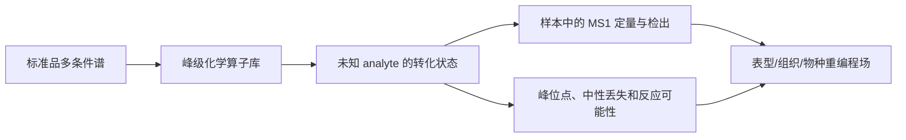

# 标准品锚定的峰级化学算子图谱

## 0. 结论先行

“输入一张标准品 MS/MS，查它出现在哪些样本、组织或疾病中”本质上是 reverse spectral search。即使换成 DreaMS embedding，再把命中结果画成网络，也不构成新的研究对象。MASST 已经支持仓库级谱图反查；reverse metabolomics 已经将合成化合物的标准谱用于发现物种、器官和疾病关联；2026 年的 StructureMASST 更已支持从结构/子结构出发、多标准谱搜索、类似物和质量偏移搜索，并连接生物和技术元数据。[反向代谢组学](https://www.nature.com/articles/s41586-023-06906-8)；[StructureMASST](https://www.nature.com/articles/s41587-026-03082-8)；[MASST](https://www.nature.com/articles/s41587-019-0375-9)。

真正值得验证的新对象不是“标准谱命中图”，而是：

> **把每个标准化合物的多条件谱图拆解成一组可复用的峰级化学测量算子；在每个生物样本中，分别测量“完整身份证据、保守子结构证据、定向结构转换证据、中性丢失/反应证据、MS1 定量和技术可检测性”，形成一个标准品 × 样本 × 证据通道的响应张量。**

标准品在这里不再只是一个“答案”，而是定义化学坐标轴的**探针**；未知物也不再被迫命名，而是被表达为“相对于某个标准探针的哪一种峰级转化状态”。

## 1. 文献排除：哪些图已经有了

| 已有图谱/方法 | 图的基本对象 | 已解决的问题 | 对新方法的硬约束 |
|---|---|---|---|
| DreaMS Atlas | 大规模谱图节点与 3-NN embedding 边 | 组织 2.01 亿张 MS/MS 的全局谱空间 | 不能仅换一个相似度图 | 
| MASST / reverse metabolomics | 参考谱→仓库命中→样本元数据 | 某分子在哪些公开样本出现 | 不能把“反向搜库”当创新 |
| StructureMASST | 结构/子结构→多参考谱→精确/类似/修饰命中→元数据 | 结构中心的全公库分布、类似物和盲修饰 | 不能仅增加 analog 和峰位点解释 |
| GNPS FBMN / 近邻 suspect library | 特征谱图节点与谱相似边 | 已知物周围的未知类似物家族 | 不能把普通分子网络改名为 atlas |
| ModiFinder | 结构已知的 helper 谱与修饰 analog 谱 | 局部化结构修饰位点 | “峰差→修饰位点”的 pairwise 功能已有 |
| MetDNA / KGMN | 反应网、谱相似、峰相关的多层图 | 从已知 seed 向未知反应邻居传播注释 | 不能仅加 Rhea/KEGG 一跳边 |
| IIMN | MS1 共洗脱/峰形/离子质量关系边 | 拆除加合物、多聚体和源内碎片冗余 | 新 atlas 必须先合并同一 analyte 的离子形式 |
| MEMO | 每个样本的全部碎片和中性丢失词袋 | 不依赖 RT 对齐的样本级化学指纹 | 不能仅把样本变成谱峰向量 |

主要依据：[DreaMS Atlas](https://www.nature.com/articles/s41587-025-02663-3)；[KGMN](https://www.nature.com/articles/s41467-022-34537-6)；[MetDNA](https://www.nature.com/articles/s41467-019-09550-x)；[IIMN](https://www.nature.com/articles/s41467-021-23953-9)；[MEMO](https://pmc.ncbi.nlm.nih.gov/articles/PMC9580960/)；[ModiFinder](https://pmc.ncbi.nlm.nih.gov/articles/PMC11540723/)；[仓库级近邻 suspect library](https://www.nature.com/articles/s41467-023-44035-y)。

## 2. 新图谱的基本数学对象

设：

- \(p\)：标准化合物探针，由多仪器、多碰撞能、多加合形式的参考谱集定义；
- \(s\)：生物样本；
- \(u\)：样本中的 analyte-level 未知特征/谱族，已先经 IIMN 式去冗余；
- \(k\)：证据通道，不是一个总相似度。

图谱的核心不是二分命中 \(p\leftrightarrow s\)，而是多通道响应张量：

\[
\mathcal A_{p,s,k}=\operatorname{Aggregate}_{u\in s}
\left[E_k(p,u)\times Q(u,s)\times D(p,u,s)\right].
\]

其中：

- \(E_k(p,u)\)：标准探针与未知 analyte 之间的第 \(k\) 类峰级证据；
- \(Q(u,s)\)：该 analyte 在样本中的 MS1 峰面积/检出证据；
- \(D(p,u,s)\)：在该仪器、碰撞能、加合形式和采集密度下的可检测性校正。

\(k\) 至少包括：

1. **identity channel**：前体、RT/流动度（若有）、加合物、同位素与跨条件 MS/MS 共同支持的完整身份证据；
2. **conserved-core channel**：标准品在多条件谱中稳定的碎片/中性丢失子集，表示保守子结构；
3. **transformation channel**：成对的保留峰、平移峰和消失/新生峰，表示相对于探针的定向结构变化；
4. **reaction/loss channel**：与明确元素组成和反应差质量兼容的中性丢失/碎片对；
5. **quantitative channel**：连回同一 analyte 的 MS1 强度矩阵，与 MS2 被选中次数分开；
6. **detectability channel**：明示区分真缺失、DDA 未触发、峰弱和采集条件不匹配。

所以一个标准品在一个样本中不只返回“有/无”或一个 cosine，而是一个证据向量：

\[
R(p,s)=[I, C, T, L, Q, D].
\]

## 3. 两张必须同时成立的图

### 3.1 化学转化场

以标准探针为原点，未知 analyte 依据保守峰和变化峰被放入可解释的方向：

\[
p \xrightarrow[\text{localized peak evidence}]{\Delta m,\,\Delta fragments} u.
\]

这张图不给未知物强行赋予精确名称，而是回答：它保留了哪个化学核心，改变更可能发生在哪一部分，证据是由哪些峰支持的。

### 3.2 生物重编程场

在样本轴上，不再只检验一个有名代谢物的差异，而是检验整个“探针锚定的转化家族”是否重编程：

\[
\Delta_{phenotype}\mathcal A_{p,\cdot,k}.
\]

这可以区分：

- 已知母体上升，但未知 analog 不变；
- 母体不变，但某一定向转化家族协同上升；
- 相同质量范围的高相似谱中，只有保留关键峰证据的分支与表型相关；
- 表面的疾病富集其实是仪器/采集系统偏差。

两张图通过同一个 \(u\) 对象耦合，构成真正的“双重映射”：

## 4. 它与“搜库”的不可约化差异

| 问题 | 普通搜库/反向搜索 | 峰级算子图谱 |
|---|---|---|
| 输出基本单元 | 标准谱与样本谱的命中 | 标准探针在每个样本的多通道响应 |
| 未知物 | 与某已知谱相似 | 位于某标准探针的可解释转化坐标 |
| 峰级信息 | 用来计算总分或事后解释 | 本身定义多条独立证据通道 |
| 生物学 | 命中后汇总样本元数据 | 转化家族的定量重编程是主分析对象 |
| 缺失 | 通常当作未命中 | 明式分解为真缺失与技术未观测 |
| 身份不确定性 | 往往丢成单一阈值 | 身份不确定与子结构/转化证据分开保留 |

如果最后的实现只产生“标准品 A 在 31% 样本中出现”，那就没有实现这个方法，仍然只是 StructureMASST/MASST 的局部版。

## 5. 现有项目模块怎样进入，且不冒充真值

| 现有模块 | 在图谱中的位置 | 严格边界 |
|---|---|---|
| 官方 DreaMS | 建立跨条件候选邻域 | 不当身份真值 |
| 噪声微调 embedding | 若独立证明更鲁棒，替代候选邻域的 embedding | 必须在匹配协议下先过干净检索门；不借 P2b 定义教师 |
| P2b | 独立谱学通道，为候选边提供 RAW/中性丢失证据 | 不是新 embedding，不能把其局部盲测收益写成全局 SOTA |
| 峰级双重映射 | 定义 conserved-core 与 transformation 算子，并返回峰级忠实性 | 必须通过目标删峰、匹配随机删峰和反事实峰对照 |
| ChemAware | 给证据通道提供化学语义，如元素可能性和中性丢失 | 当前特异性门未过，不得作为纠正真值 |
| BioAware | 在候选转换已由谱学支持后，提供反应/物种/组织先验 | 不得反向覆盖身份证据；之前的一跳覆盖已失败 |
| MS1 队列定量 | 给 analyte 节点提供样本强度和检出率 | 不用 MS2 触发次数代替丰度 |

## 6. 真正可查询的四类科学问题

1. **从标准品出发**：该完整分子在哪些样本有高置信度证据？它的哪些保守核和转换家族在哪里出现？
2. **从未知物出发**：它最接近哪一条标准品化学轴？保留了哪些峰级子结构证据？变化在哪个局部？
3. **从生物表型出发**：哪些标准品锚定的转换家族整体发生重编程，而不是哪个单峰有一个模糊名称？
4. **从机制出发**：哪条峰级转换边在独立队列复现，与候选酶/微生物/组织共定位，而且不能被仪器和可检测性解释？

前两类是化学地图，后两类才是生物学发现。如果系统只会答第 1 题的“哪里有”，则方法学失败。

## 7. 最小但决定性的证明：先证明“新对象”有用

不立即建全球 atlas。先做一个可以杀死概念的 A0：

### 7.1 数据要求

- 选择 3–4 个化学家族，每家族必须有多个实测标准品、多条件参考谱和多个含已知阳性的公开队列；
- 优先验证胆汁酸共轭物、酰基肉碱、核苷/修饰核苷、韘脂/神经酰胺，因为它们都有清楚的系列化差质量和可验证的峰级核心；
- 以 study 或仪器平台为外部切分单元，不用 spectrum 随机切分。

### 7.2 隐藏真值测试

对已知标准品人为隐藏精确名称，只保留其近邻探针，要求系统：

- 将其放在正确的探针化学轴上；
- 正确识别保守峰与变化峰；
- 在独立 study 中还原正确的出现/定量模式；
- 在同分异构体上保留歧义，不伪造精确身份。

### 7.3 必须超过的对照

- cosine / entropy / 官方 DreaMS 的单分检索；
- StructureMASST/MASST 的精确与 analog 命中结果；
- GNPS molecular networking 或最近邻 suspect library；
- ModiFinder 的 pairwise 修饰位点；
- MEMO 的样本指纹表型分组；
- KGMN/MetDNA 的反应邻居传播。

不要求一个总分在所有任务都赢。新方法必须在它声称新增的两个能力上赢：

1. **转换状态恢复**：已知隐藏类似物的探针轴归属与峰级位点证据；
2. **跨队列重编程复现**：探针转换家族的表型效应在 study-held-out 中复现，并超过只用已知命中或样本词袋的结果。

### 7.4 预注册失败门

任一情况出现，就不得把它写成新 atlas 方法：

- 多通道张量不比最佳单一谱相似度更好地恢复隐藏转换；
- 表型关联被 study/instrument 分层后消失；
- 去掉已知身份后，未知转换家族不再提供额外生物信息；
- 峰级算子在目标删峰与匹配随机删峰之间没有特异性；
- 所谓“转化场”只是 precursor mass difference 或 DreaMS 近邻的重命名。

## 8. 生物学论文的最终形态

如果方法成立，论文不应以“注释率提高了多少”收尾，而应以一个以下结构的生物发现闭环收尾：

1. 一个标准品锚定的化学家族中，多个未知转化态在疾病/组织中协同改变；
2. 变化由保守峰和修饰敏感峰的系统性替换支持，不是一个黑箱相似度；
3. 整个家族的 MS1 丰度模式在独立队列或公共数据中复现；
4. 只有对于关键分支，才用少量标准品或已有同平台参考证据升级身份置信度；
5. 生物学机制来自“整个转化场的重编程”，不是从一个低置信度分子名跳到某条通路。

这里，有名标准品是地图的锚，未知转化家族是地图的新大陆，生物队列则提供它们的功能地形。

## 9. 对当前 MTBLS13729 的诚实定位

MTBLS13729 可以作为这张图的局部用例，但不足以单独支撑全方法：

- 它有 MS1 与 MS2，可以建 analyte × sample 的定量层；
- 它可用现有 DreaMS/P2b 生成候选与谱学证据；
- 但 Rmu 只有 10 对，缺 pooled QC，且当前冻结结果只有一个 arachidonoylcarnitine-like 名义优先特征，未达 FDR 确认；
- 因此它适合展示“探针家族如何落到一个小队列”，不适合用来首次证明全球 atlas 的统计性能和广泛生物价值。

## 10. 当前裁决

1. **废止主创新表述**：“标准品反向搜索”、“更大的标准—样本图”、“用最少标准品消歧”。
2. **保留为模块**：反向搜索用于找样本；主动选标准品用于后续验证；二者都不是论文主方法。
3. **新方法候选**：标准品多谱→峰级算子库→未知转换场→样本响应张量→表型重编程场。
4. **下一步不是大规模开发**：先用已知阳性和 study-held-out 设计证明多通道响应张量比最佳检索/分子网络/样本指纹多出不可替代的信息。
5. **首创状态**：这是经文献排除后值得实验的候选方法空白，不得在 A0 成功之前宣称首创或 SOTA。

## Sources

1. Huan T, et al. [Reverse metabolomics for the discovery of chemical structures from humans](https://www.nature.com/articles/s41586-023-06906-8). *Nature* 626, 419–426 (2024).
2. Bittremieux W, et al. [Structure-centric searching enables global mapping of the public metabolome](https://www.nature.com/articles/s41587-026-03082-8). *Nature Biotechnology* (2026).
3. Huber F, et al. [Self-supervised learning of molecular representations from millions of tandem mass spectra using DreaMS](https://www.nature.com/articles/s41587-025-02663-3). *Nature Biotechnology* (2025).
4. Wang M, et al. [Mass spectrometry searches using MASST](https://www.nature.com/articles/s41587-019-0375-9). *Nature Biotechnology* 38, 23–26 (2020).
5. Zhou Z, et al. [Metabolite annotation from knowns to unknowns through knowledge-guided multi-layer metabolic networking](https://www.nature.com/articles/s41467-022-34537-6). *Nature Communications* 13, 6656 (2022).
6. Shen X, et al. [Metabolic reaction network-based recursive metabolite annotation for untargeted metabolomics](https://www.nature.com/articles/s41467-019-09550-x). *Nature Communications* 10, 1516 (2019).
7. Schmid R, et al. [Ion identity molecular networking for mass spectrometry-based metabolomics in the GNPS environment](https://www.nature.com/articles/s41467-021-23953-9). *Nature Communications* 12, 3832 (2021).
8. Gaudry A, et al. [MEMO: Mass Spectrometry-Based Sample Vectorization to Explore Chemodiverse Datasets](https://pmc.ncbi.nlm.nih.gov/articles/PMC9580960/). *Frontiers in Bioinformatics* 2, 842964 (2022).
9. Dorfer V, et al. [ModiFinder: Tandem Mass Spectral Alignment Enables Structural Modification Site Localization](https://pmc.ncbi.nlm.nih.gov/articles/PMC11540723/). (2024).
10. Bittremieux W, et al. [Open access repository-scale propagated nearest neighbor suspect spectral library for untargeted metabolomics](https://www.nature.com/articles/s41467-023-44035-y). *Nature Communications* 14, 8488 (2023).
